# 🚀 Quick Push to Remote (Do this first!)

```bash
cd existing_repo
git remote add origin https://vcs.technonext.com/jakir.hosen/gitlab-pipeline.git
git branch -M master
git push -uf origin master
git pull --rebase
```

---

# Simple Calculator (Go) — **prod** Branch (SemVer Tag Release)

A minimal Go web application with an HTML calculator UI, health checks, and request tracing.  
The **prod** release flow is **tag-driven** and only runs when you create a **SemVer tag** like `v1.1.1`.

This GitLab CI/CD pipeline:

1) **Builds** the Docker image on the GitLab Shell Runner  
2) **Pushes** the image to **Docker Hub** with the SemVer tag  
3) Also updates a moving tag: **`:prod`**  
4) **Pulls** the tagged image and **deploys** it on the runner host


-2E7D32)


---

## Production access

After a successful **prod** release (tag pipeline), open:

- UI: `http://<PROD_HOST>:7001/`
- Health: `http://<PROD_HOST>:7001/healthz`

> Replace `<PROD_HOST>` with the hostname/IP of the machine where your GitLab **shell runner** executes the deploy step.

Example health check:
```bash
curl -s http://<PROD_HOST>:7001/healthz
```

Expected output:
```text
calculator healthy
```

---

## Release process (tag-based)

### ✅ Required tag format
Production requires tags like:

- ✅ `v1.0.0`
- ✅ `v2.14.3`
- ❌ `1.0.0`
- ❌ `v1.0`
- ❌ `v1.0.0-rc1`

Regex enforced by CI:
```
^v[0-9]+\.[0-9]+\.[0-9]+$
```

### Create and push a release tag

```bash
git tag v1.0.0
git push origin v1.0.0
```

That tag triggers the prod pipeline.

---

## What this app does

- Serves a browser calculator UI on `GET /`
- Processes calculations via `POST /calculator`
- Supports operators: `add`, `subtract`, `multiply`, `divide`
- Exposes a liveness endpoint: `GET /healthz`
  - Response body: `<SERVICE_NAME> healthy`
- Adds `X-Request-ID` for traceability and logs request latency

---

## Endpoints

| Method | Path | Description |
|---:|---|---|
| GET | `/` | Render calculator UI |
| POST | `/calculator` | Calculate and render result |
| GET | `/healthz` | Liveness check (200 OK) |

`POST /calculator` form fields:
- `num1` (float)
- `num2` (float)
- `operator` (`add` \| `subtract` \| `multiply` \| `divide`)

---

## Project structure

- `main.go` — server, routes, middleware, calculator logic, `/healthz`
- `index.html` — UI template rendered by Go
- `main_test.go` — handler + middleware tests
- `Dockerfile` — multi-stage build + non-root runtime
- `go.mod` / `go.sum` — Go module + dependency lock
- `.gitignore` — ignore local/build artifacts
- `.gitlab-ci.yml` — **prod release CI/CD** (tag build + push + deploy)

---

## How the prod pipeline works (build → push → pull → deploy)

The prod pipeline runs **only** when `$CI_COMMIT_TAG` is present.

1. Validate tag matches `vMAJOR.MINOR.PATCH`
2. Build and tag image: `"$DOCKERHUB_IMAGE:$CI_COMMIT_TAG"`
3. Push the SemVer tag to Docker Hub
4. Tag + push a moving tag: `:prod`
5. Pull the SemVer tag from Docker Hub
6. Deploy by replacing the running container and starting the new one

### Pipeline stages
- `build-prod`
- `push-prod`
- `deploy-prod`

### Mermaid flow (CI/CD)

```mermaid
flowchart LR
  A[Create SemVer Tag vX.Y.Z] --> B[GitLab CI Tag Pipeline]
  B --> C[Validate Tag Format]
  C --> D[Docker Hub Login]
  D --> E[Build Image :vX.Y.Z]
  E --> F[Push Image :vX.Y.Z]
  F --> G[Tag + Push :prod]
  G --> H[Pull Image :vX.Y.Z]
  H --> I[Stop/Remove Existing Container]
  I --> J[Run New Container]
  J --> K[Service Live on :7001]
  K --> L[Healthz: /healthz]
```



---

## CI/CD configuration (prod)

This README matches the following `.gitlab-ci.yml` behavior for production:

### Key variables

| Variable | Example | Purpose |
|---|---|---|
| `PROD_CONTAINER_NAME` | `source-code-prod` | Container name on the prod host |
| `PROD_PORT` | `7001` | Host port for prod |
| `APP_PORT_INTERNAL` | `9000` | Container port the app listens on |
| `DOCKERHUB_IMAGE` | `myorg/source-code-prod` | Docker Hub image name (`namespace/project`) |

### Tag rules
- Jobs run only when `CI_COMMIT_TAG` exists.
- Each job re-validates the tag format and fails fast if invalid.

### Docker Hub auth
The pipeline uses a shared login block:
- `.dockerhub_login` logs in with `DOCKERHUB_USERNAME` + `DOCKERHUB_TOKEN`
- `set -euo pipefail` ensures strict failure behavior

---

## Required CI/CD secrets (Docker Hub)

Configure these GitLab CI/CD variables as **Masked** and **Protected**:

| Variable | Purpose |
|---|---|
| `DOCKERHUB_USERNAME` | Docker Hub username |
| `DOCKERHUB_TOKEN` | Docker Hub access token (preferred over password) |
| `DOCKERHUB_NAMESPACE` | Docker Hub org/user |
| `DOCKERHUB_PROJECT` | Docker Hub project/repo name (prod) |

Derived value used by the pipeline:
- `DOCKERHUB_IMAGE="$DOCKERHUB_NAMESPACE/$DOCKERHUB_PROJECT"`

Security recommendations:
- Use a scoped Docker Hub token (least privilege).
- Mark variables as **Protected** so they only work on protected tags.
- Protect tags in GitLab (only release managers can create them).

---

## Operational notes

### Where the deployment happens
Deployment happens on the **GitLab shell runner host**:
- lock down runner access (SSH, firewall, patching)
- restrict Docker daemon access and audit usage
- ensure `7001` exposure aligns with your security policy

### Rollback strategy (recommended)
Because production uses immutable SemVer tags, rollback is clean:

1. Pick a previous stable tag (example: `v1.0.3`)
2. Redeploy it:
   ```bash
   docker pull "$DOCKERHUB_IMAGE:v1.0.3"
   docker rm -f source-code-prod || true
   docker run -d --name source-code-prod -p 7001:9000 --restart always      --security-opt no-new-privileges:true --cap-drop ALL      "$DOCKERHUB_IMAGE:v1.0.3"
   ```

> Tip: you can also deploy the moving `:prod` tag, but SemVer tags are recommended for auditability.

---

## Local development

### Prerequisites
- Go **1.22+**
- Docker (optional)

### Run (Go)
```bash
go mod download
go test ./...
go run .
```

Open:
- `http://localhost:9000/`
- `http://localhost:9000/healthz`

### Run (Docker)
```bash
docker build -t simple-calculator:local .
docker run --rm -p 9000:9000 -e SERVICE_NAME=calculator simple-calculator:local
```

---

## Security notes

- Container runs as **non-root** (`UID/GID 65532` from the Dockerfile)
- Runtime uses a minimal base image with `ca-certificates`
- Deploy flags include:
  - `--security-opt no-new-privileges:true`
  - `--cap-drop ALL`

---

## License

Add a license file if you plan to distribute this project externally.