# 🚀 Quick Push to Remote (Do this first!)

```bash
cd existing_repo
git remote add origin https://vcs.technonext.com/jakir.hosen/gitlab-pipeline.git
git branch -M master
git push -uf origin master
git pull --rebase
```

---

# Simple Calculator (Go) — **stage** Branch (Docker Hub Build + Deploy)

A minimal Go web application with an HTML calculator UI, health checks, and request tracing.  
The **stage** branch runs a GitLab CI/CD pipeline that:

1) **Builds** the Docker image on the GitLab Shell Runner  
2) **Pushes** the image to **Docker Hub**  
3) **Pulls** the same image from Docker Hub  
4) **Deploys** it on the runner host (direct-to-host deployment)


-2E7D32)


---

## What this app does

- Serves a browser calculator UI on `GET /`
- Processes calculations via `POST /calculator`
- Supports operators: `add`, `subtract`, `multiply`, `divide`
- Exposes a liveness endpoint: `GET /healthz`
  - Response body: `<SERVICE_NAME> healthy`
- Adds `X-Request-ID` for traceability and logs request latency

---

## Stage environment access

After a successful **stage** pipeline run, open:

- UI: `http://<STAGE_HOST>:6001/`
- Health: `http://<STAGE_HOST>:6001/healthz`

> Replace `<STAGE_HOST>` with the hostname/IP of the machine where your GitLab **shell runner** executes the deploy step.

Example health check:
```bash
curl -s http://<STAGE_HOST>:6001/healthz
```

Expected output:
```text
calculator healthy
```

---

## Endpoints

| Method | Path | Description |
|---:|---|---|
| GET | `/` | Render calculator UI |
| POST | `/calculator` | Calculate and render result |
| GET | `/healthz` | Liveness check (200 OK) |

`POST /calculator` form fields:
- `num1` (float)
- `num2` (float)
- `operator` (`add` \| `subtract` \| `multiply` \| `divide`)

---

## Project structure

- `main.go` — server, routes, middleware, calculator logic, `/healthz`
- `index.html` — UI template rendered by Go
- `main_test.go` — handler + middleware tests
- `Dockerfile` — multi-stage build + non-root runtime
- `go.mod` / `go.sum` — Go module + dependency lock
- `.gitignore` — ignore local/build artifacts
- `.gitlab-ci.yml` — **stage branch CI/CD** (build + push + deploy)

---

## How the stage pipeline works (build → push → pull → deploy)

On the **stage** branch, the pipeline performs:

1. **Build** the Docker image locally on the runner host  
2. **Login** to Docker Hub using a token (CI variable)  
3. **Push** an immutable image tag: `:$CI_PIPELINE_IID`  
4. **Also push** a moving convenience tag: `:stage`  
5. **Pull** the immutable tag from Docker Hub  
6. **Deploy** by replacing the running container and starting a new one  

### Pipeline stages
- `build-stage`
- `push-stage`
- `deploy-stage`

### Deployment model
This is a **registry-backed direct-to-host** deployment:
- Docker commands run on the GitLab **shell runner machine**
- The image is stored in **Docker Hub**
- The app is exposed via host port **6001** → container port **9000**

### Mermaid flow (CI/CD)

```mermaid
flowchart LR
  A[Git Push to stage] --> B[GitLab CI Pipeline]
  B --> C[Build Docker Image]
  C --> D[Docker Hub Login]
  D --> E[Push :CI_PIPELINE_IID]
  E --> F[Tag + Push :stage]
  F --> G[Pull :CI_PIPELINE_IID]
  G --> H[Stop/Remove Existing Container]
  H --> I[Run New Container]
  I --> J[Service Live on :6001]
  J --> K[Healthz: /healthz]
```



---

## CI/CD configuration (stage)

This README matches the following `.gitlab-ci.yml` behavior on the `stage` branch:

- Build: `docker build -t "$DOCKERHUB_IMAGE:$CI_PIPELINE_IID" .`
- Push:
  - `docker push "$DOCKERHUB_IMAGE:$CI_PIPELINE_IID"`
  - `docker tag ... "$DOCKERHUB_IMAGE:stage"` and push
- Deploy:
  - `docker pull "$DOCKERHUB_IMAGE:$CI_PIPELINE_IID"`
  - `docker rm -f "$STAGE_CONTAINER_NAME" || true`
  - `docker run -d ... -p 6001:9000 ... "$DOCKERHUB_IMAGE:$CI_PIPELINE_IID"`

### Expected GitLab runner
This pipeline requires a **GitLab Shell Runner** that can run Docker commands.

- Runner tag: `shell-runner`
- Docker Engine installed on the runner host
- Runner user has permission to access Docker (e.g., member of `docker` group)
- Network egress from runner host to Docker Hub (push/pull)

---

## Required CI/CD secrets (Docker Hub)

Configure these GitLab CI/CD variables as **Masked** and **Protected**:

| Variable | Purpose |
|---|---|
| `DOCKERHUB_USERNAME` | Docker Hub username |
| `DOCKERHUB_TOKEN` | Docker Hub access token (preferred over password) |
| `DOCKERHUB_NAMESPACE` | Docker Hub org/user (often same as username) |
| `DOCKERHUB_REPO` | Docker Hub repo name (e.g., `source-code-stage`) |

Derived value used by the pipeline:
- `DOCKERHUB_IMAGE="$DOCKERHUB_NAMESPACE/$DOCKERHUB_REPO"`

Security recommendations:
- Keep Docker Hub token scoped minimally (least privilege).
- Restrict protected variables to protected branches only.
- Restrict who can push to the `stage` branch (branch protections).

---

## Stage pipeline variables (from CI)

| Variable | Example | Purpose |
|---|---|---|
| `STAGE_CONTAINER_NAME` | `source-code-stage` | Container name on the stage host |
| `STAGE_PORT` | `6001` | Host port for stage |
| `APP_PORT_INTERNAL` | `9000` | Container port the app listens on |
| `DOCKERHUB_IMAGE` | `myteam/source-code-stage` | Full Docker Hub image name |

Tag strategy:
- Immutable: `:$CI_PIPELINE_IID` (recommended for audit + rollback)
- Moving: `:stage` (convenience only)

---

## Operational notes

### Where the deployment happens
The deploy step runs on the **GitLab shell runner host**:
- protect the runner host (access control + patching + logging)
- restrict Docker daemon access (least privilege + auditing)
- ensure port `6001` is open only as required

### Rollback strategy (recommended)
Because immutable tags are pushed to Docker Hub, rollback is straightforward:

1. Find a previous pipeline IID (from GitLab pipeline history)
2. Redeploy that image tag:
   ```bash
   docker pull "$DOCKERHUB_IMAGE:<OLD_PIPELINE_IID>"
   docker rm -f source-code-stage || true
   docker run -d --name source-code-stage -p 6001:9000 --restart always      --security-opt no-new-privileges:true --cap-drop ALL      "$DOCKERHUB_IMAGE:<OLD_PIPELINE_IID>"
   ```

---

## Local development

### Prerequisites
- Go **1.22+**
- Docker (optional)

### Run (Go)
```bash
go mod download
go test ./...
go run .
```

Open:
- `http://localhost:9000/`
- `http://localhost:9000/healthz`

### Run (Docker)
```bash
docker build -t simple-calculator:local .
docker run --rm -p 9000:9000 -e SERVICE_NAME=calculator simple-calculator:local
```

---

## Security notes

- Container runs as **non-root** (`UID/GID 65532` from the Dockerfile)
- Runtime uses a minimal base image with `ca-certificates`
- Deploy flags include:
  - `--security-opt no-new-privileges:true`
  - `--cap-drop ALL`

---

## License

Add a license file if you plan to distribute this project externally.