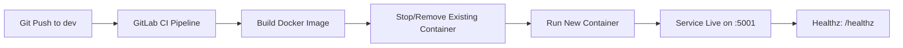

# 🚀 Quick Push to Remote (Do this first!)

```bash
cd existing_repo
git remote add origin https://vcs.technonext.com/jakir.hosen/gitlab-pipeline.git
git branch -M master
git push -uf origin master
git pull --rebase
```

---

# Simple Calculator (Go) — **dev** Branch (GitLab CI Local Deploy)

A minimal Go web application with an HTML calculator UI, health checks, and request tracing.  
The **dev** branch includes a **GitLab CI/CD pipeline** that **builds and deploys the container directly on the GitLab Shell Runner host** (no Docker Hub push in dev).


-2E7D32)


---

## What this app does

- Serves a browser calculator UI on `GET /`
- Processes calculations via `POST /calculator`
- Supports operators: `add`, `subtract`, `multiply`, `divide`
- Exposes a liveness endpoint: `GET /healthz`
  - Response body: `<SERVICE_NAME> healthy`
- Adds `X-Request-ID` for traceability and logs request latency

---

## Dev environment access

After a successful **dev** pipeline run, open:

- UI: `http://<DEV_HOST>:5001/`
- Health: `http://<DEV_HOST>:5001/healthz`

> Replace `<DEV_HOST>` with the hostname/IP of the machine where your GitLab **shell runner** executes the deploy step.

Example health check:
```bash
curl -s http://<DEV_HOST>:5001/healthz
```

Expected output:
```text
calculator healthy
```

---

## Endpoints

| Method | Path | Description |
|---:|---|---|
| GET | `/` | Render calculator UI |
| POST | `/calculator` | Calculate and render result |
| GET | `/healthz` | Liveness check (200 OK) |

`POST /calculator` form fields:
- `num1` (float)
- `num2` (float)
- `operator` (`add` \| `subtract` \| `multiply` \| `divide`)

---

## Project structure

- `main.go` — server, routes, middleware, calculator logic, `/healthz`
- `index.html` — UI template rendered by Go
- `main_test.go` — handler + middleware tests
- `Dockerfile` — multi-stage build + non-root runtime
- `go.mod` / `go.sum` — Go module + dependency lock
- `.gitignore` — ignore local/build artifacts
- `.gitlab-ci.yml` — **dev branch CI/CD** (build + deploy)

---

## How the dev pipeline works (build → deploy)

On the **dev** branch, the pipeline performs:

1. **Build** the Docker image locally on the runner host  
2. **Deploy** by replacing the existing container and running the new image  
3. Applies container hardening flags (least privilege)

### Pipeline stages
- `build-dev`
- `deploy-dev`

### Deployment model
This is a **direct-to-host** deployment:
- Docker commands run on the GitLab **shell runner machine**
- The app is exposed via host port **5001** → container port **9000**

### Mermaid flow (CI/CD)



---

## CI/CD configuration (dev)

### Expected GitLab runner
This pipeline is designed for a **GitLab Shell Runner** that can run Docker commands.

- Runner tag: `shell-runner`
- Docker Engine must be installed on the runner host
- Runner user needs permission to access Docker (e.g., member of `docker` group)

### Key CI variables used (dev)

These are defined in the dev pipeline file:

| Variable | Example | Purpose |
|---|---|---|
| `STAGE_IMAGE_NAME` | `source-code-dev` | Local image name |
| `STAGE_CONTAINER_NAME` | `source-code-dev` | Container name on the dev host |
| `STAGE_PORT` | `5001` | Host port for dev |
| `APP_PORT_INTERNAL` | `9000` | Container port the app listens on |

> Note: variable names keep `STAGE_` prefix for consistency across environments, even though this branch is `dev`.

### What the jobs do (summary)

#### Build job
- Builds the Docker image:
  - Tag: `:$CI_PIPELINE_ID`

#### Deploy job
- Replaces the running container:
  - `docker rm -f <name> || true`
  - `docker run -d ... -p 5001:9000 ... <image>:<pipeline_id>`

Hardening flags used:
- `--restart always`
- `--security-opt no-new-privileges:true`
- `--cap-drop ALL`

---

## Operational notes

### Where the deployment happens
This pipeline deploys **directly on the GitLab shell runner host**. Ensure:
- the runner host is hardened and access-controlled
- Docker daemon access is restricted (least privilege) and audited
- branch protections are in place to prevent unauthorized deployments

### Rollback strategy (simple)
Because dev images are tagged by pipeline ID:
1. List images on the runner host:
   ```bash
   docker images | grep source-code-dev
   ```
2. Re-run the container with a previous tag:
   ```bash
   docker rm -f source-code-dev || true
   docker run -d --name source-code-dev -p 5001:9000 --restart always      --security-opt no-new-privileges:true --cap-drop ALL      source-code-dev:<OLD_PIPELINE_ID>
   ```

---

## Local development

### Prerequisites
- Go **1.22+**
- Docker (optional)

### Run (Go)
```bash
go mod download
go test ./...
go run .
```

Open:
- `http://localhost:9000/`
- `http://localhost:9000/healthz`

### Run (Docker)
```bash
docker build -t simple-calculator:local .
docker run --rm -p 9000:9000 -e SERVICE_NAME=calculator simple-calculator:local
```

---

## Security notes

- Container runs as **non-root** (`UID/GID 65532` from the Dockerfile)
- Runtime uses a minimal base image with `ca-certificates`
- Recommended runtime flags:
  - `--security-opt no-new-privileges:true`
  - `--cap-drop ALL`

---

## License

Add a license file if you plan to distribute this project externally.