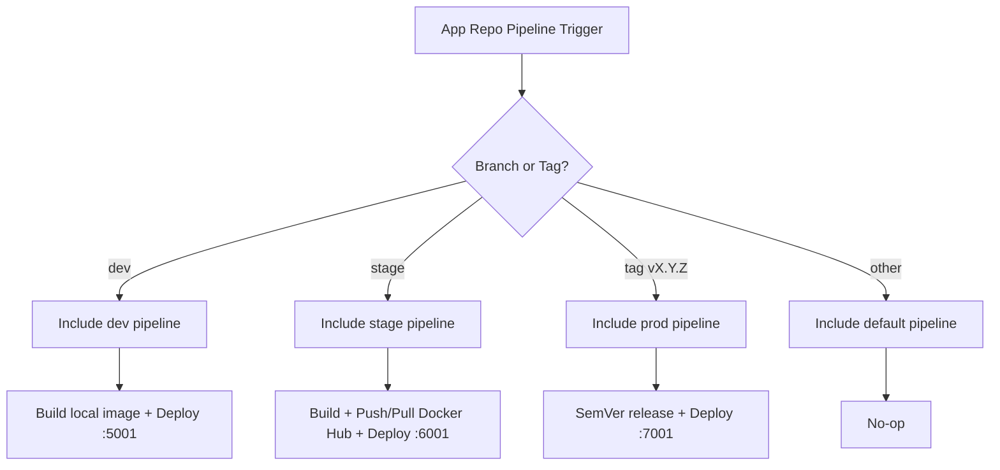

# 🚀 Quick Push to Remote (Do this first!)

```bash
cd existing_repo
git remote add origin https://vcs.technonext.com/jakir.hosen/gitlab-pipeline.git
git branch -M master
git push -uf origin master
git pull --rebase
```

---

# gitlab-pipeline — Master Overview (Branches + Centralized CI/CD)

This repository is a **DevOps-managed CI/CD & reference project** that demonstrates:

1) A **centralized GitLab CI/CD router** (to prevent `.gitlab-ci.yml` merge conflicts in application repos)  
2) A sample **Go web app** (“Simple Calculator”) that is deployed across **dev / stage / prod** using branch/tag-specific pipelines  
3) Supporting docs for **GitLab Runner setup** and operational workflow

> Primary objective: **make CI/CD consistent and conflict-free** by keeping environment pipelines in a dedicated **`pipeline` branch**, while app repos include a single stable entry file.

---

## ✅ Pipeline-first: How this repo’s CI/CD architecture works

### Why centralized CI?
Problem:
- Application repositories often have different `.gitlab-ci.yml` per branch.
- Developers merge branches frequently, causing **CI file merge conflicts**.

Solution (this repo):
- Application repos keep only a small, stable `.gitlab-ci.yml` that includes the router from this repo.
- The router dynamically loads the correct environment pipeline based on **branch/tag**.

### High-level routing logic

```text
dev branch               -> dev pipeline (build + deploy on runner host)
stage branch             -> stage pipeline (build + push to Docker Hub + pull + deploy)
SemVer tag vX.Y.Z        -> prod pipeline (build + push + deploy)
other branches           -> default pipeline (disabled / no deployment)
```

### Mermaid diagram (routing)



---

## 🔧 How to implement this in an application repository (copy/paste)

In your **application repository**, create a minimal `.gitlab-ci.yml`:

```yaml
include:
  - project: "jakir.hosen/gitlab-pipeline"
    ref: "pipeline"
    file: "/.gitlab-ci-b2c-common.yml"
```

That’s the only CI file developers should touch in the app repo.  
All environment pipelines are maintained centrally in this repo’s **`pipeline`** branch.

---

## 🧩 What lives where (master branch folders)

Master branch contains **6 folders** that map to **6 branches** and their responsibilities:

| Folder | Branch | Purpose |
|---|---|---|
| `pipeline/` | `pipeline` | Central CI/CD router + env pipelines (source of truth) |
| `source_code/` | `source_code` | Base application source (Go calculator) |
| `dev/` | `dev` | Dev deployment branch + dev CI pipeline (local build/deploy) |
| `stage/` | `stage` | Stage deployment branch + stage CI pipeline (Docker Hub) |
| `prod/` | `prod` | Production release documentation + tag-based deployment model |
| `gitlab-runner-setup/` | `gitlab-runner-setup` | Runner installation/hardening notes and setup helpers |

> Think of **master** as the “table of contents”.  
> Each folder documents and/or mirrors the branch that actually runs the pipeline.

---

## ⭐ Recommended setup order (so everything works)

### 1) Set up GitLab Runner (shell-runner)
Use `gitlab-runner-setup/` branch/folder to:
- install GitLab Runner
- configure a **shell runner**
- install Docker Engine on the runner host
- secure access (least privilege)

Minimum requirements:
- Runner tag: `shell-runner`
- Docker installed and running
- Runner user can run Docker (group `docker`)
- outbound access to Docker Hub (stage/prod)

### 2) Configure CI/CD variables in GitLab
For stage/prod pipelines, set these variables as **Masked** + **Protected**:

Common:
- `DOCKERHUB_USERNAME`
- `DOCKERHUB_TOKEN`
- `DOCKERHUB_NAMESPACE`

Stage:
- `DOCKERHUB_REPO`

Prod:
- `DOCKERHUB_PROJECT`

### 3) Adopt the centralized include in application repos
Use the minimal `.gitlab-ci.yml` include snippet shown above.

### 4) Use branches/tags to drive deployments
- `dev` branch → deploy to port `5001`
- `stage` branch → deploy to port `6001`
- `vX.Y.Z` tag → deploy to port `7001`

---

## 🌿 Branch-by-branch explanation (what each branch does)

### 1) `pipeline` branch (most important)
Folder: `pipeline/`

Contains:
- `.gitlab-ci-b2c-common.yml` (router)
- environment pipelines:
  - `deployment-dev/.gitlab-ci-dev.yml`
  - `deployment-stage/.gitlab-ci-stage.yml`
  - `deployment-prod/.gitlab-ci-prod.yml`
- `default/.gitlab-ci-default.yml` (no-op)

This branch is what application repos reference via `include:project`.

---

### 2) `source_code` branch
Folder: `source_code/`

Contains:
- Go calculator app
- Dockerfile (multi-stage)
- HTML template
- tests
- `/healthz` endpoint returns: `<SERVICE_NAME> healthy`

Purpose:
- stable base source code for all env branches.

---

### 3) `dev` branch
Folder: `dev/`

Pipeline behavior:
- build Docker image locally on runner host
- deploy container on runner host
- port mapping:
  - host `5001` → container `9000`

Use-case:
- fast feedback environment; no registry involved.

---

### 4) `stage` branch
Folder: `stage/`

Pipeline behavior:
- build image on runner host
- push image to Docker Hub using immutable tag `:$CI_PIPELINE_IID`
- also push moving tag `:stage`
- pull immutable image and deploy on runner host
- port mapping:
  - host `6001` → container `9000`

Use-case:
- pre-prod validation with registry-backed images.

---

### 5) `prod` branch (tag-driven release)
Folder: `prod/`

Pipeline behavior:
- runs only on tags matching SemVer: `vMAJOR.MINOR.PATCH` (example: `v1.0.0`)
- build + push `:$CI_COMMIT_TAG`
- also push moving tag `:prod`
- deploy on runner host
- port mapping:
  - host `7001` → container `9000`

Use-case:
- controlled releases; audit-friendly and rollback-friendly.

---

### 6) `gitlab-runner-setup` branch
Folder: `gitlab-runner-setup/`

Contains:
- runner installation notes
- recommended hardening and permissions
- Docker prerequisites
- operational guidance

Use-case:
- onboarding and standardizing runner hosts.

---

## 🧪 How to test the full flow quickly

### Dev deploy
1. Push to `dev`
2. Check:
   - `http://<DEV_HOST>:5001/`
   - `http://<DEV_HOST>:5001/healthz`

### Stage deploy
1. Merge/push to `stage`
2. Check:
   - `http://<STAGE_HOST>:6001/`
   - `http://<STAGE_HOST>:6001/healthz`

### Prod release
1. Tag and push:
   ```bash
   git tag v1.0.0
   git push origin v1.0.0
   ```
2. Check:
   - `http://<PROD_HOST>:7001/`
   - `http://<PROD_HOST>:7001/healthz`

---

## 🔐 Security & best practices (recommended)

- Use **protected branches** for `stage` and **protected tags** for production releases
- Mark Docker Hub variables as **Masked + Protected**
- Use dedicated runners per environment if possible
- Audit Docker daemon access and runner host SSH access
- Prefer immutable tags (`CI_PIPELINE_IID` for stage, SemVer for prod)

---

## Maintainers
DevOps owns and maintains:
- the **`pipeline`** branch (CI source of truth)
- runner setup guidance
- environment deployment conventions
