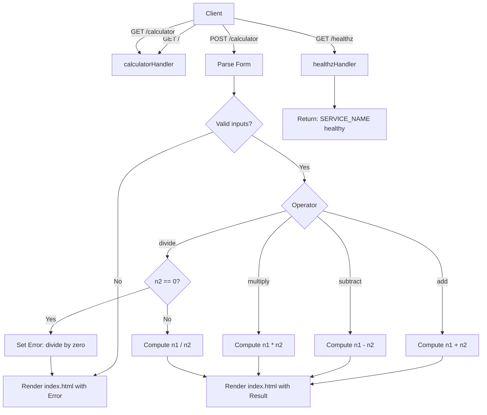

# 🚀 Quick Push to Remote (Do this first!)

```bash
cd existing_repo
git remote add origin https://vcs.technonext.com/jakir.hosen/gitlab-pipeline.git
git branch -M master
git push -uf origin master
git pull --rebase
```

---

# 🧮 Go Calculator App (Docker + CI/CD Ready) — GenZ README

Welcome to this branch! This is a tiny **Go web app** that serves a simple calculator UI + a clean health endpoint for deployments.  
It’s built to be **container-first**, easy to run in **GitLab CI/CD**, and safe-by-default (non-root container, hardened Docker run flags).

---

## ✨ What’s inside?

✅ A minimal Go HTTP server  
✅ HTML UI for calculator input/output  
✅ `/healthz` endpoint that returns: `SERVICE_NAME healthy`  
✅ Request tracing with `X-Request-ID`  
✅ Unit tests for handlers + middleware  
✅ Multi-stage Dockerfile (small, secure runtime image)

---

## 🗂️ Repo files (what each thing does)

| File | What it does |
|------|--------------|
| `main.go` | Go HTTP server (routes, handlers, middleware, health) |
| `main_test.go` | Unit tests for calculator + request-id + healthz |
| `index.html` | Simple calculator UI template |
| `go.mod` | Go module name + dependencies (Go 1.22) |
| `go.sum` | Dependency checksums (locked integrity) |
| `Dockerfile` | Multi-stage build → minimal runtime container |
| `.gitignore` | Ignore local/build artifacts |

---

## 🧠 App behavior (Routes)

| Route | Method | Purpose |
|------|--------|---------|
| `/` | GET | Shows calculator UI |
| `/calculator` | GET/POST | GET shows UI, POST calculates |
| `/healthz` | GET | Health probe → returns text |

### ❤️ Health endpoint output

Example:
```bash
curl -s http://localhost:9000/healthz
```

Output:
```text
calculator healthy
```

You can customize the service name:
- `SERVICE_NAME=calculator`
- `SERVICE_NAME=source-code-stage`
- etc.

---

## 🧩 How the code works (the vibe)

### 1) Template loading (`index.html`)
- The HTML is loaded once at startup.
- Then reused for every request (fast + clean).

### 2) Middleware: Request ID + latency log
Every request gets:
- Header: `X-Request-ID: <uuid>`
- Log line: method + path + duration

So when something breaks in production, you can trace it like a pro.

### 3) Calculator handler
- GET → renders the form
- POST → reads form fields:
  - `num1`, `num2`, `operator`
- Performs operation:
  - add, subtract, multiply, divide
- Safeguards:
  - invalid numbers → error
  - divide by zero → error
  - missing parameters → error

### 4) Health handler
- Always returns HTTP 200
- Body: `<SERVICE_NAME> healthy`

Perfect for:
- load balancer health checks
- Kubernetes probes
- CI smoke tests

---

## 🧭 Flow diagram (Mermaid)



---

## 🏃 Run locally (fast)

### Prerequisites
- Go **1.22+**
- Docker (optional)

### Run (Go)
```bash
go test ./...
go run .
```

### Test endpoints
```bash
curl -i http://localhost:9000/healthz
curl -i http://localhost:9000/
```

---

## 🐳 Run with Docker (recommended)

### Build
```bash
docker build -t calculator:local .
```

### Run
```bash
docker run --rm -p 9000:9000 -e SERVICE_NAME=calculator calculator:local
```

### Health check
```bash
curl -s http://localhost:9000/healthz
```

Expected:
```text
calculator healthy
```

---

## 🔐 Security notes (small app, serious mindset)

✅ Multi-stage build → no Go toolchain in runtime image  
✅ `alpine:3.20` + `ca-certificates` only  
✅ Runs as **non-root user (uid 65532)**  
✅ Designed to run with hardened flags (as your CI does):
- `--security-opt no-new-privileges:true`
- `--cap-drop ALL`

---

## 🧪 Tests (what’s covered)

`main_test.go` validates:
- GET renders OK (HTTP 200)
- POST add returns correct result
- divide-by-zero error
- method not allowed (405)
- middleware sets `X-Request-ID`
- `/healthz` returns `service healthy`

Run:
```bash
go test ./... -v
```

---

## ⚙️ Environment variables

| Variable | Default | Purpose |
|---------|---------|---------|
| `HOST` | `0.0.0.0` | Bind address |
| `PORT` | `9000` | Listen port |
| `SERVICE_NAME` | `calculator` | Health endpoint prefix |


---

## 🧑‍💻 Maintainer

DevOps maintains this branch to keep the app **deployable**, **testable**, and **CI/CD-friendly**.