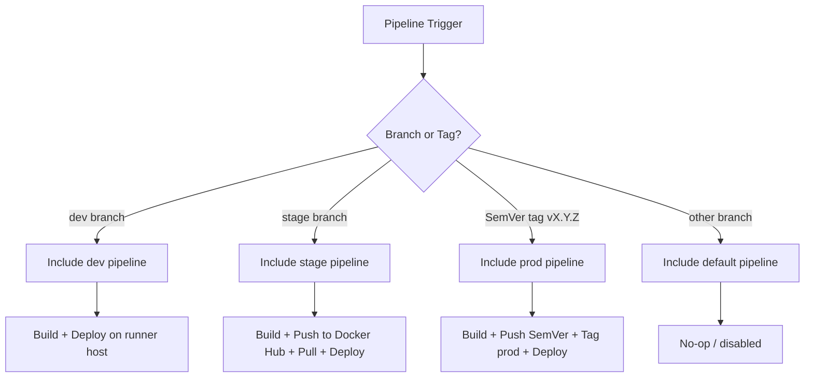

# 🚀 Quick Push to Remote (Do this first!)

```bash
cd existing_repo
git remote add origin https://vcs.technonext.com/jakir.hosen/gitlab-pipeline.git
git branch -M master
git push -uf origin master
git pull --rebase
```

---

# gitlab-pipeline — Centralized GitLab CI/CD Router (pipeline branch)

This branch is the **single source of truth** for CI/CD across multiple application repositories.

Goal: **avoid merge conflicts** in application repos by keeping CI logic out of app branches (developers merge code, DevOps maintains pipelines).  
Apps keep a minimal `.gitlab-ci.yml` that **includes** the common router file from this repo. The router then loads the correct pipeline file based on **branch/tag**.

---

## What problem this solves

### The pain
- Different `.gitlab-ci.yml` per branch (`dev`, `stage`, `prod`) causes **constant merge conflicts** when developers merge branches.
- Developers usually don’t want to maintain CI files; DevOps does.

### The fix
- **One common include** across all branches in app repos.
- **Branch-specific pipelines live here** in the `pipeline` branch:
  - `dev` → build + deploy locally (runner host)
  - `stage` → build + push to Docker Hub + pull + deploy
  - `prod` → SemVer tag-only release (build + push + deploy)
  - others → disabled/default (no deployment)

---

## Repository layout (pipeline branch)

```
.
├── .gitlab-ci-b2c-common.yml          # Router (used by all app repos)
├── deployment-dev/
│   └── .gitlab-ci-dev.yml             # Dev pipeline
├── deployment-stage/
│   └── .gitlab-ci-stage.yml           # Stage pipeline
├── deployment-prod/
│   └── .gitlab-ci-prod.yml            # Prod pipeline (tag-based)
└── default/
    └── .gitlab-ci-default.yml         # Default pipeline (disabled)
```

---

## How consuming application repos should use this

In each **application repository**, keep `.gitlab-ci.yml` stable and minimal:

```yaml
include:
  - project: "jakir.hosen/gitlab-pipeline"
    ref: "pipeline"
    file: "/.gitlab-ci-b2c-common.yml"
```

That file should rarely change, so merges stay conflict-free.

---

## The router: `.gitlab-ci-b2c-common.yml`

### What it does
1) Allows pipelines for both **branches** and **tags** using `workflow:rules`  
2) Uses `include:` with `rules:` to load exactly one pipeline file:
- `dev` branch → dev pipeline
- `stage` branch → stage pipeline
- `prod` branch and/or SemVer tag → prod pipeline
- anything else → default pipeline (disabled)

### Router selection (summary)

```text
dev branch               -> deployment-dev/.gitlab-ci-dev.yml
stage branch             -> deployment-stage/.gitlab-ci-stage.yml
prod branch              -> deployment-prod/.gitlab-ci-prod.yml (jobs run on tags only)
vMAJOR.MINOR.PATCH tag   -> deployment-prod/.gitlab-ci-prod.yml
other branches           -> default/.gitlab-ci-default.yml (does nothing)
```

### Mermaid flow (routing)



---

## Pipelines explained

### 1) Default pipeline (other branches)
File: `default/.gitlab-ci-default.yml`

- Contains a placeholder job with:
  - `rules: when: never`
- Purpose: prevent accidental deployments on feature branches.

---

### 2) Dev pipeline (branch = `dev`)
File: `deployment-dev/.gitlab-ci-dev.yml`

**Stages**
- `build-dev`
- `deploy-dev`

**Build**
- Builds locally on the runner host:
  - Image: `source-code-dev:$CI_PIPELINE_ID`

**Deploy**
- Replaces container and runs new image:
  - Container: `source-code-dev`
  - Host port: `5001` → container port `9000`
- Hardened runtime flags:
  - `--security-opt no-new-privileges:true`
  - `--cap-drop ALL`
  - `--restart always`

**Where it deploys**
- Directly onto the **GitLab shell runner host**.

---

### 3) Stage pipeline (branch = `stage`)
File: `deployment-stage/.gitlab-ci-stage.yml`

**Stages**
- `build-stage`
- `push-stage`
- `deploy-stage`

**Build**
- Builds image tagged by pipeline IID:
  - `"$DOCKERHUB_IMAGE:$CI_PIPELINE_IID"`

**Push**
- Logs into Docker Hub using token
- Pushes:
  - Immutable tag: `:$CI_PIPELINE_IID`
  - Moving tag: `:stage`

**Deploy**
- Pulls immutable tag and runs container:
  - Container: `source-code-stage`
  - Host port: `6001` → container port `9000`
- Same hardened runtime flags as dev.

---

### 4) Prod pipeline (tag-only release)
File: `deployment-prod/.gitlab-ci-prod.yml`

**Stages**
- `build-prod`
- `push-prod`
- `deploy-prod`

**Trigger**
- Jobs run only when **`CI_COMMIT_TAG` exists**
- Tag must match SemVer format:
  - `vMAJOR.MINOR.PATCH` (example: `v1.1.1`)
  - Regex enforced in each job:
    - `^v[0-9]+\.[0-9]+\.[0-9]+$`

**Image strategy**
- Pushes immutable release tag:
  - `:$CI_COMMIT_TAG`
- Also updates moving tag:
  - `:prod`

**Deploy**
- Pulls `:$CI_COMMIT_TAG` and runs:
  - Container: `source-code-prod`
  - Host port: `7001` → container port `9000`

**Important note**
- The router includes prod pipeline for the `prod` branch as well, but **jobs execute only for tags** (`rules: if: $CI_COMMIT_TAG`).
  - Recommended: treat production as **tag-driven** releases.

---

## Required GitLab CI/CD variables (secrets)

### Docker Hub (stage + prod)
Set these in GitLab **CI/CD Variables** as **Masked** and **Protected**:

- `DOCKERHUB_USERNAME`
- `DOCKERHUB_TOKEN`
- `DOCKERHUB_NAMESPACE`

Additional per environment:
- Stage: `DOCKERHUB_REPO`
- Prod: `DOCKERHUB_PROJECT`

Derived in pipelines:
- Stage: `DOCKERHUB_IMAGE="$DOCKERHUB_NAMESPACE/$DOCKERHUB_REPO"`
- Prod:  `DOCKERHUB_IMAGE="$DOCKERHUB_NAMESPACE/$DOCKERHUB_PROJECT"`

---

## Runner requirements (shell-runner)

All pipelines run Docker commands, so the runner host must have:

- GitLab Runner configured with tag: `shell-runner`
- Docker Engine installed and running
- Runner user can run docker (e.g., in `docker` group)
- Network access to Docker Hub for stage/prod push/pull

Security recommendations:
- Use dedicated runners per environment (dev/stage/prod).
- Restrict prod runner execution to protected tags only.
- Audit runner access and Docker daemon usage.

---

## Release guide

### Dev
- Push to `dev` branch → builds and deploys to port `5001`

### Stage
- Push/merge to `stage` branch → builds, pushes to Docker Hub, deploys to port `6001`

### Prod (recommended)
Create and push a SemVer tag:

```bash
git tag v1.0.0
git push origin v1.0.0
```

- Tag pipeline builds, pushes, and deploys to port `7001`

---

## Troubleshooting

### Pipeline runs but no jobs appear
- Verify the branch name matches `dev` / `stage` / `prod`, or you used a SemVer tag.
- For production: jobs require a tag (not just the `prod` branch).

### Docker Hub push/pull fails
- Check `DOCKERHUB_USERNAME` / `DOCKERHUB_TOKEN`
- Confirm variables are available for that branch/tag (protected vs unprotected)

### Deploy works but service not reachable
- Confirm host port is open:
  - dev `5001`, stage `6001`, prod `7001`
- Verify container is running:
  ```bash
  docker ps
  docker logs -f <container_name>
  ```

---

## Change management

This repo impacts deployments across multiple services. Recommended process:

- Use merge requests + reviews for CI changes
- Keep changes small and auditable
- Prefer tag pinning for consuming repos if strict immutability is required:
  - `ref: vX.Y.Z` instead of `ref: pipeline` (optional governance)

---

## Maintainers
DevOps owns and maintains this repository and the `pipeline` branch that application repos include.